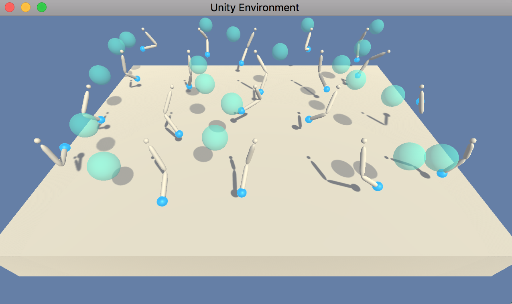

# Project 2: Continuous-Control

## 1. Overview
The purpose of this project is to train an agent which
controls doubly-jointed robot arms such that the end points of the
arms are located at target locations inside a three-dimensional space.
Deep Deterministic Policy Gradient (DDPG) algorithm is used for training the agent.
The repository for this project provided by Udacity is available
[here](https://github.com/udacity/deep-reinforcement-learning/tree/master/p2_continuous-control).

## 2. Environment
In this project, I use the environment **Option 2** in which
**20** doubly-jointed robot arms are contained.
- **State**: The state space of the environment (for each robot arm)
is **33**-dimensional. The state encodes
position, rotation, velocity and angular velocities of the arm.
- **Action**:
The action space of the environment (for each robot arm) is
**4**-dimensional. Each element takes a continuous value within [-1, 1].  
- **Reward**: At each time step, for each agent, a reward **+0.1** is provided if the
endpoint of the arm is correctly guided to the target location inside a
three-dimensional space.

The task is episodic. I use the average score over the last 100 episodes
and over the 20 robot arms as a metric for measuring the performance of the trained agent. The environment is regarded as being solved when the average score becomes
**30** or higher.

A captured image example from the simulator for this environment is displayed below:


## 3. Training Algorithm
For training models, I have implemented Deep Deterministic Policy Gradient (DDPG) algorithm.  
For further details, please refer to the report `continous_control.pdf`
and the references therein.

## 4. Contents of Repository
This repository contains the following files:
- `model.py`: This Python file contains the modules `Actor` and `Critic` which
defines the neural networks for the actor model and critic model, respectively.
- `ddpg_agent.py`: This Python file defines the module `Agent` defining DDPG agent.
This file also defines
the module `ReplayBuffer` for the normal replay buffer as well as
the module `OUNoise` for generating noises for actions based on the Ornstein-Uhlenbeck
process.
- `Continuous_Control.ipynb`: By running the cells in this Jupyter notebook, the DDPG
agent is trained. The performance of the trained model can be also checked with it.   
- `Continuous_Control.html`: html export of `Continuous_Control.ipynb`.
- `Report.pdf`: This pdf file summarizes the DDPG algorithm used in this project and
performance of the trained agent.
- `weights/check_point_actor.pth`: this file stores the weights of the trained
actor model.
- `weights/check_point_critic.pth`: this file stores the weights of the trained
critic model.
- `README.md`: This markdown file itself.
- `image`: this folder contains images used for this markdown as well as the
report `Report.pdf`.

On top of this, the simulator for the environment is available from the following links:
- [for Linux](https://s3-us-west-1.amazonaws.com/udacity-drlnd/P2/Reacher/Reacher_Linux.zip),
- [for Mac OSX](https://s3-us-west-1.amazonaws.com/udacity-drlnd/P2/Reacher/Reacher.app.zip),
- [for Windows (32-bit)](https://s3-us-west-1.amazonaws.com/udacity-drlnd/P2/Reacher/Reacher_Windows_x86.zip),
- [for Windows(64-bit)](https://s3-us-west-1.amazonaws.com/udacity-drlnd/P2/Reacher/Reacher_Windows_x86_64.zip).

Outside this repository, the performance of the trained agent can be watched at
[YouTube](https://youtu.be/oOIoZQl99og).

## 4. Setup and Dependencies
To play with the codes I provide, please setup the Python environment
by following the instruction by Udacity (see [here](https://github.com/udacity/deep-reinforcement-learning)
for further detail):

0. **Anaconda**: If Anaconda is not installed, install from the
[official website](https://www.anaconda.com/).
1. **Python Environment**: Create and activate a new Python environment with Python 3.6
  - For Linux or Mac
  ```
  conda create --name drlnd python=3.6
  source activate drlnd
  ```
  - For Windows  
  ```
  conda create --name drlnd python=3.6
  activate drlnd
  ```
2. **OpenAI Gym**: Follow the instruction of
[OpenAI Gym repository](https://github.com/openai/gym) to carry out
the minimum install of OpenAI Gym. Install
[**classic control**](https://github.com/openai/gym#classic-control)
and [**box2d environment**](https://github.com/openai/gym#box2d).
3. **Install Dependencies**
Clone the repository for Deep Reinforcement Learning Nanodegree by Udacity a
and install several dependencies as follows:
```
git clone https://github.com/udacity/deep-reinforcement-learning.git
cd deep-reinforcement-learning/python
pip install .
```
4. **IPython kernel** Create IPython kernel for this Python environment:
```
python -m ipykernel install --user --name drlnd --display-name "drlnd"
```
Choose kernel `drlnd` when one runs the Jupyter notebook `Continous_Control.ipynb`.

## 5. Instruction
To play, run the cells in `Continuous_Control.ipynb`. This will automatically
start the simulator. The agents are trained and their performance
can be seen in the end. Performance of the agent can be watched at [YouTube](https://youtu.be/oOIoZQl99og).
